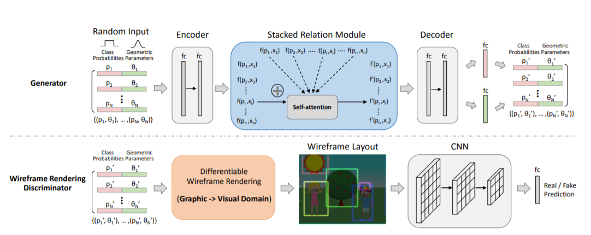

# LayoutGAN (unofficial)
This repository provides the unofficial code in Tensorflow 2.0 for the paper "LayoutGAN: Generating Graphic Layouts with Wireframe Discriminators"
https://arxiv.org/abs/1901.06767
### Architecture  

## Prerequisites
- Python 3.8
- Tensorflow 2.5.0

## MNIST Generation
1. Use [MNIST Dataset](https://drive.google.com/file/d/1qtBnEWsaKXeynOCUFHB7H9eqU6bDLJAV/view?usp=sharing). Download and put it in the data folder.
2. Dataset has dimension of (70,000, 9, 9), which consists of 70,000 samples, which contains 128 foreground pixels cordinates (N, 128, X, Y).
3. Run `python MNIST/mnist_train.py` to train a model.
4. Predictions will be saved in `samples/MNIST_results`.
### Results on MNIST

## Document Layout Generation
1. Use [PubLayNet Dataset](https://drive.google.com/file/d/1YQKyASvGDNUTJnE1x-Q2ZhhiY0VFj7oZ/view?usp=sharing). Download and put it in data folder.
2. Dataset has dimension of (72499, 9, 9), which consists of 72,499 single column layout samples extracted from PubLayNet dataset, which contains atmost 9 bounding boxes,for each bounding box first four elements are dimensions of bounding boxes (X_centre, Y_centre, Width, Height).
3. Run `python publaynet/train.py` to train a model.
4. Predictions will be saved in `samples/publaynet_results`.
### Results on single column layouts

## Related repositories
Some codes are implemented from
https://github.com/JiananLi2016/LayoutGAN-Tensorflow

